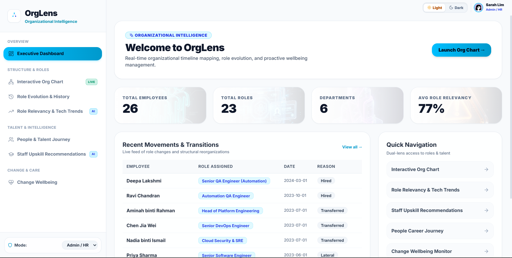
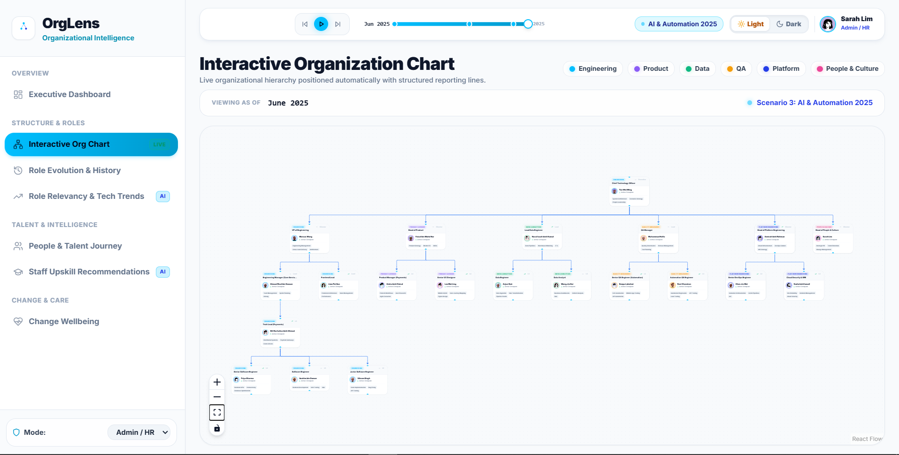
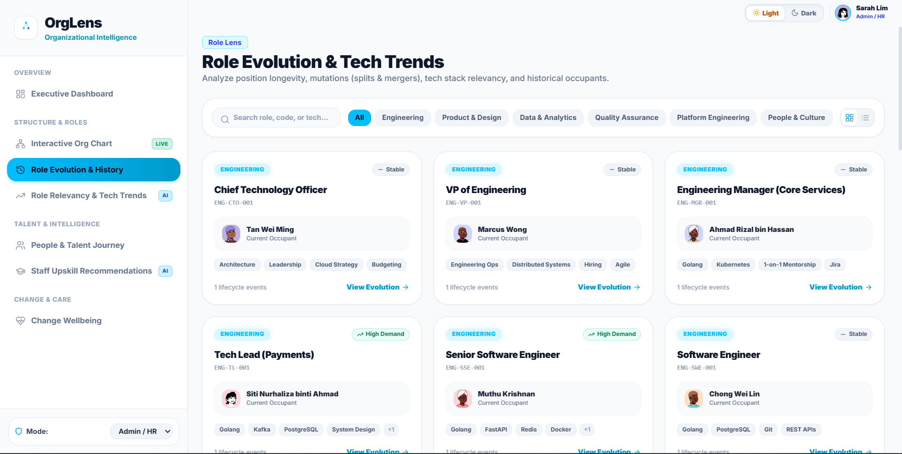
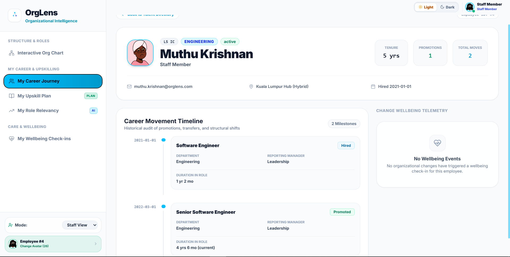

# OrgLens

**Mapping how roles and people evolve over time.**


OrgLens turns scattered HR records into a single, time-aware picture of an organisation. It answers two questions that are normally painful to reconstruct by hand:

- **How has this role changed over the last few years?** — title changes, redesignations, reporting-line shifts, splits, merges, and headcount changes, laid out as one ordered history.
- **What has this person's journey been since they joined?** — hires, promotions, transfers, department changes, and shifts in who they report to, laid out as a clear trajectory.

These are two views of the same story. A person occupies a role at a point in time, so as roles change and people move, the two histories weave together. OrgLens lets you move between them and see exactly where they intersect: who held a role at a given date, and how a person's move relates to the structural change happening around them.

---

## Screenshots

### Dashboard

*Real-time stats, recent movements, and flagged anomalies at a glance.*

### Interactive Org Chart (Time-Travel)

*Scrub the timeline to any date and see how the structure and occupants change.*

### Role Evolution Timeline

*Full chronological history of a role: mutations, occupants, reporting shifts.*

### Person Career Journey

*A person's complete trajectory — hires, promotions, transfers, and department changes.*


---

## How it maps to the problem statement

| Requirement | How OrgLens delivers it |
| --- | --- |
| Accept data from a structured or unstructured source | CSV ingestion endpoint (`POST /api/upload`) plus a rich seeded demo dataset (`seed_data.py`). Sample import templates live in `backend/data/`. |
| Reconstruct a role's history in chronological order | `GET /api/role-history/{role_id}` merges creation, mutations (renamed/split/merged/reporting change), occupant changes, and reporting-line shifts into one sorted timeline. Rendered as the **Position Evolution Timeline** on each role page. |
| Reconstruct a person's journey over time | `GET /api/movements/{employee_id}` reconstructs every assignment with reason and the manager active at that time. Rendered as the **Career Movement Timeline** on each person page. |
| Connect the two views | The `assignments` table (person ↔ role, with start/end dates) is the shared spine. The **time-travel org chart** (`GET /api/org-tree?date=`) resolves, for any date, which roles existed *and* who occupied them. Move from a role to its occupants, or from a person to the structure around them. |
| Present clearly via an interactive timeline/visual view | An interactive org chart (React Flow + Dagre auto-layout) with a **timeline scrubber**, plus per-entity vertical timelines and charts. |
| Handle incomplete or inconsistent records gracefully | A rule-based anomaly detector (`GET /api/anomalies`) flags missing reporting lines, vacant positions, tenure stagnation, and reorg transition stress. Surfaced on the dashboard and inline on affected pages. |

---

## The grounding scenario, built in

The seeded dataset models a fictional fintech org across **2021–2025** so the connection between role change and people movement is visible, not abstract. It intentionally encodes real storylines:

- **Fast-track promotion** — an engineer moves Software Engineer → Senior → Tech Lead in two years.
- **Career stagnation** — an engineer sits in the same mid-level role for 3.5+ years (flagged as an anomaly).
- **A QA transformation** — manual testing is phased out and automation roles grow, with real exits and re-hires.
- **A structural split** — in Q3 2023 a Platform Engineering department is spun out of Core Engineering, with reporting lines restructured.

Three restructuring scenarios (Baseline 2021, Platform Split 2023, AI & Automation 2025) anchor the timeline, so scrubbing the date on the org chart replays how the structure actually changed.

---

## Feature tour

**Role view**
- **Role Evolution** directory with market-trend badges (High Demand / Automation Risk / Transforming / Stable) and tech-stack chips.
- **Role detail** with a chronological Position Evolution Timeline, historical occupants, reporting context, and an AI-style relevancy gauge.

**People view**
- **Talent Journey** directory with career-velocity badges (Fast Track / Steady Growth / Stagnation Risk).
- **Person detail** with a Career Movement Timeline, tenure/promotion/move metrics, a stagnation banner when relevant, and wellbeing telemetry.

**The connection**
- **Interactive Org Chart** — a time-travel hierarchy. Scrub the timeline to any date and the chart redraws with the roles that existed then and the people who held them.

**Supporting analysis**
- **Anomaly flagging** for messy/incomplete data (orphan roles, vacant positions, stagnation, transition stress).
- **Role Relevancy & Tech Trends**, **Upskilling recommendations**, **Work telemetry** (title vs. actual work from ticket logs), and **Change Wellbeing** check-ins.

**Two personas**
- **Admin / HR** sees org-wide views for the review scenario.
- **Staff** sees a self-scoped view of their own journey, role relevancy, and upskilling plan. Switch personas from the sidebar.

**Solana Royalty Wallet**

A simulated Solana-based employee royalty wallet system for company-funded perks (meals, parking, rewards):

- **Staff view** (`/my-wallet`) — Dark-themed wallet card displaying SOL balance, Solana wallet address with copy button, QR code for tap-to-pay at cafeteria/vending/parking, payment form to spend SOL at merchants, and full transaction history (color-coded: green for reloads, red for payments, amber for rewards).
- **Admin view** — Each employee's person detail page shows their wallet balance, address, and a custom reload input (admin can reload any amount, not just the monthly default).
- **Wallet Analytics Dashboard** (`/wallet-dashboard`) — Company-wide treasury overview with: total company spend, total reloaded, utilization rate (% of SOL actually used), rewards distributed, monthly budget overview, spending breakdown by merchant, top spenders leaderboard, and low-balance alerts for employees needing a top-up.
- **How it works** — Each employee is assigned a unique Solana-style wallet address on creation. The company reloads SOL monthly (configurable per employee). Staff spend at merchants (cafeteria, parking, Grab Food, vending). Rewards are issued for upskilling milestones and performance bonuses. All transactions are logged with simulated Solana transaction hashes.

---

## Architecture

- **Backend** — FastAPI + SQLite (plain `sqlite3`, no ORM). A temporal, event-sourced schema is the core idea: entities carry `created_at` / `retired_at` / `status`, and history lives in dedicated tables.
  - `roles` + `role_mutations` → how positions change.
  - `employees` + `assignments` (person ↔ role over time) → how people move, and who held a role when.
  - `reporting_lines`, `departments`, plus `ticket_logs`, `role_relevancy`, `wellbeing_checkins`, and `scenarios` for the supporting views.
- **Frontend** — React 18 + Vite, React Router, `@xyflow/react` + `dagre` for the org chart, Recharts for charts, Tailwind CSS for styling, Axios for API calls.
- The frontend talks to `/orglens-service/*`, which the Vite dev proxy rewrites to the backend at `http://127.0.0.1:8000/api`.

### Key endpoints

| Endpoint | Purpose |
| --- | --- |
| `GET /api/org-tree?date=YYYY-MM-DD` | Time-travel org hierarchy valid at a date, with occupants resolved. |
| `GET /api/role-history/{role_id}` | Chronological evolution of a single role. |
| `GET /api/movements/{employee_id}` | A person's full career trajectory. |
| `GET /api/roles` · `GET /api/roles/{id}` | Roles with occupants, mutations, and relevancy. |
| `GET /api/employees` · `GET /api/employees/{id}` | People with their assignment history. |
| `GET /api/anomalies` | Flagged gaps and inconsistencies. |
| `GET /api/dashboard/stats` | Headline counts and recent movements. |
| `POST /api/upload` | Import a CSV (routed to a table by filename). |

Once the backend is running, the full interactive API reference is at `http://localhost:8000/docs`.

---

## How to Run

### Prerequisites

- Python 3.10+
- Node.js 18+

### Quick Start (Single Terminal)

```bash
# Install dependencies (first time only)
cd frontend && npm install && cd ..
npm install

# Seed database + start both servers
npm run setup
```

This starts the backend (port 8000) and frontend (port 5173) together. Open [http://localhost:5173](http://localhost:5173).

### Available Commands

| Command | What it does |
|---------|-------------|
| `npm run setup` | Seeds the database, then starts backend + frontend |
| `npm run dev` | Starts backend + frontend (skip seeding) |
| `npm run seed` | Re-seeds the database only |

### Manual Start (Two Terminals)

If you prefer running them separately:

**Terminal 1 — Backend:**
```bash
cd backend
pip install -r requirements.txt
python seed_data.py
uvicorn main:app --reload
```

**Terminal 2 — Frontend:**
```bash
cd frontend
npm install
npm run dev
```

### After Pulling Changes

When you pull new code from the repo, re-seed the database to sync data:

```bash
npm run seed
```

Then restart the backend (or use `npm run setup` to do both).

### Open in Browser

Go to [http://localhost:5173](http://localhost:5173). Start on the Dashboard, open the **Org Chart**, and scrub the timeline to watch the structure evolve. Then drill into a role or a person to follow either history, and toggle the **Staff** persona to see the individual's own view.

> **Note:** The database file (`orglens.db`) is gitignored — each team member generates it locally by running `npm run seed` or `python seed_data.py`. This ensures everyone has identical data.

### Importing your own data

The demo runs on the seeded dataset by default. To load your own records, send CSVs to `POST /api/upload`. The target table is chosen from the filename (e.g. `..._employees.csv`, `..._roles.csv`, `..._departments.csv`, `..._movements.csv`, `..._tickets.csv`), and CSV columns must match the table columns. Template files are in `backend/data/`.
